  <h1>Full Stack Web Developer</h1>

<table align="center">
  <tr>
    <th align="center">
      <picture>
        
      </picture>
    </th>
    <th align="center">
      <picture>
        
      </picture>
    </th>
  </tr>
  <tr>
    <td colspan="2">
      I'm a web developer based in Spain focused on becoming a DevOps Engineer. I also am a Linux entuthiast that loves tinkering with open source projects.
    </td>
  </tr>
</table>

## My skills:

### Libraries / Frameworks

### Languages

### Databases

### Version Control

